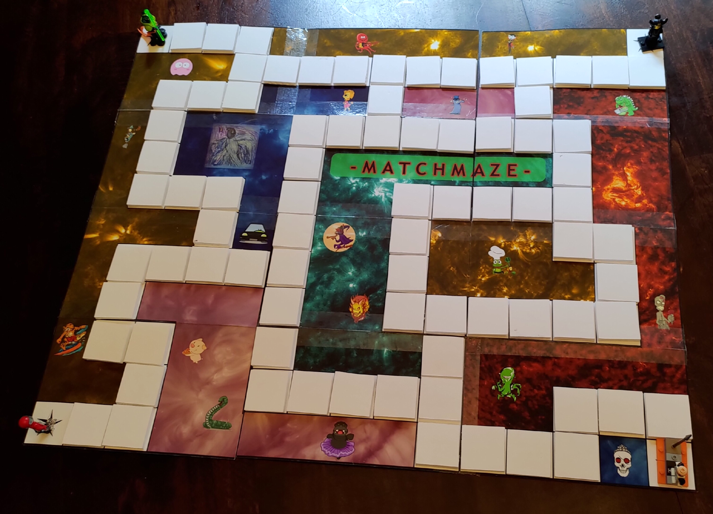

# Matchmaze

## TL;DR

Matchmaze is a home-grown board game for kids which mixes memory, tactics and
luck. There should be everything you need here to make your own version of it.
For those just wanting to grab it directly from Github, you can use the
"Download ZIP" choice from the green "Code" button.

## History

We got bored in COVID lockdown and wound up creating our own board game. It uses
a homemade board, some toy figures for players, memory-matching game cards, our
own board design, and a regular die.  The game actually turned out to be a lot
of fun so we figured we would share it so people could make their own.

This is the second iteration of the board design. The original was all drawn by
hand and had a few quirks which were fixed for this version.

## Sources

The images are home-grown, some by humans and some by AI. The exception of this
is the board background which is made up from images of the sun are various
wavelengths.

The idea and rules mostly just came up as a result of being stuck within our
four walls with not a lot else to do. The reules have been generally refined
but there is still likely room for improvement.

## Assembly

The board is made up from twelve segments which should be printed out and stuck
onto card to make the full board. The memory cards should also be printed out
and stuck onto slightly-thicker card. The board and card images are sized such
that, if they are all printed out with the same dimensions, they should all fit
correctly.

You need 80 memory cards in all but the images contain 84, leaving you with one
spare set of four. There's also an empty grid which can be used as a template
for creating your own.

If you want to attach the board segments together in such a way that they fold
up then this can be done by making them alternately fold towards and away from
one another, up and down, starting in one of the corners. The eventual folding
should work such that it folds up along an 'S' shape.

Our final version looked like this:

  

Not amazing but it works :)
